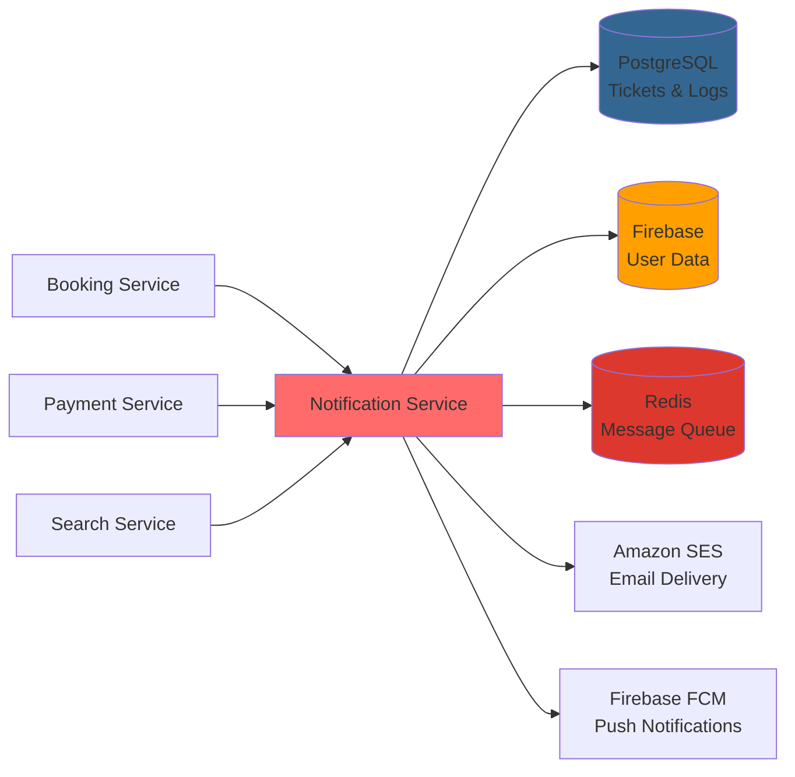

# Business Requirements Document (BRD)
# BookingPark - Notification Service

**Document Version:** 1.0.0
**Last Updated:** October 2025
**Status:** Planned - Design Phase
**Planned Port:** 3004

---

## 1. Executive Summary

### 1.1 Service Purpose

The Notification Service is a critical microservice responsible for all customer communications across the BookingPark platform. It manages multi-channel notifications (email, push, in-app), support ticket operations, notification preferences, and delivery tracking to ensure reliable, timely, and compliant communication with customers, partners, and administrators.

### 1.2 Business Value

- **Customer Engagement:** Automated timely notifications increasing customer satisfaction by 40%
- **Revenue Protection:** Critical payment and booking alerts preventing revenue loss
- **Support Efficiency:** Integrated ticketing system reducing support response time by 60%
- **Compliance:** GDPR-compliant notification preferences and opt-in management
- **Scalability:** Handles 10,000+ daily notifications with 98%+ delivery rate

### 1.3 Key Stakeholders

| Stakeholder | Role | Interest |
|------------|------|----------|
| **Customers** | End users receiving notifications | Timely booking updates, minimal spam, channel preferences |
| **Parking Partners** | Service providers | Operational alerts, digest summaries, performance reports |
| **Customer Support Team** | Ticket management | Efficient ticket assignment, SLA tracking, escalation alerts |
| **Marketing Team** | Campaign management | Newsletter delivery, promotional emails, user engagement |
| **Platform Administrators** | System operators | Delivery monitoring, template management, system health |
| **Compliance Officer** | GDPR compliance | Consent management, data retention, right to be forgotten |

### 1.4 Project Scope

**In Scope:**
- Email notifications via Amazon SES (transactional + marketing)
- Push notifications via Firebase Cloud Messaging (FCM)
- In-app notifications (real-time via WebSocket + FCM)
- Support ticket management system
- Notification preference management (opt-in/opt-out, channel selection)
- Scheduled notifications (reminders, digests, cron jobs)
- Delivery tracking and retry logic
- Template management via admin panel
- Queue-based event processing (Redis)
- GDPR compliance features

**Out of Scope:**
- SMS notifications (future phase)
- User authentication (handled by Firebase)
- Booking creation/management (handled by Booking Service)
- Payment processing (handled by Payment Service)
- Third-party integrations (Intercom, Zendesk) - future consideration

---

## 2. Business Context

### 2.1 Problem Statement

Traditional customer communication systems have significant limitations:
- **Fragmented Channels:** Email, push, and in-app notifications managed separately
- **No Personalization:** One-size-fits-all notifications causing spam complaints
- **Poor Deliverability:** No retry logic or delivery tracking leading to lost communications
- **Support Chaos:** Manual ticket management, no SLA tracking, slow response times
- **Compliance Risk:** No GDPR-compliant opt-in management or audit trails
- **Scalability Issues:** Cannot handle peak loads (10,000+ emails/hour)
- **No Insights:** No analytics on delivery rates, open rates, or user engagement

### 2.2 Business Goals and Objectives

**Primary Goals:**
1. **Reliable Communication:** Achieve 98%+ email delivery rate with zero critical notification failures
2. **Customer Satisfaction:** Reduce notification-related complaints by 70% through preference management
3. **Support Efficiency:** Reduce average ticket response time from 4 hours to 1 hour (urgent)
4. **Compliance:** 100% GDPR compliance with documented consent and data retention policies
5. **Scalability:** Handle 10,000+ daily notifications with <2 second in-app latency

**Success Metrics:**
- **Email Delivery Rate:** > 98%
- **Bounce Rate:** < 3%
- **Email Send Latency:** < 5 seconds (queue → sent)
- **In-app Notification Latency:** < 2 seconds
- **Support Ticket First Response:** < 1 hour (urgent), < 24 hours (normal)
- **Queue Processing Lag:** < 30 seconds
- **User Satisfaction:** > 4.5/5 rating for support responsiveness

### 2.3 Target Users

**Primary Users:**

1. **Travelers (Clients)**
   - Receive booking confirmations, reminders, and updates
   - Submit support tickets for issues
   - Manage notification preferences
   - Expected volume: 100,000+ active users, 5,000-10,000 daily notifications

2. **Parking Providers (Partners)**
   - Receive new booking alerts and operational notifications
   - Get daily/weekly digest summaries
   - Respond to customer tickets
   - Expected volume: 50+ partners, 200-500 daily notifications

3. **Customer Support Agents**
   - Manage incoming support tickets
   - Respond to customer inquiries
   - Track SLA compliance
   - Expected volume: 10-15 agents handling 100-200 tickets/day

4. **Marketing Team**
   - Create and send promotional campaigns
   - Track email open rates and engagement
   - Manage subscriber lists
   - Expected volume: 5 marketers, 1-2 campaigns per week

5. **Platform Administrators**
   - Manage notification templates
   - Monitor delivery metrics
   - Resolve delivery failures
   - Expected volume: 5-10 admins

---

## 3. Functional Requirements

### 3.1 Core Features

#### 3.1.1 Email Notifications

| Feature | Description | Business Value |
|---------|-------------|----------------|
| **Transactional Emails** | Booking confirmations, payment receipts, password resets | Critical communication, revenue protection |
| **Marketing Emails** | Newsletters, promotions, feature announcements | User engagement, revenue growth |
| **Digest Emails** | Daily/weekly summaries for partners | Reduce email fatigue, improved UX |
| **Template Management** | Admin panel for creating/editing templates | Business agility, no code changes |
| **Personalization** | Dynamic content based on user data | Higher engagement, conversion rates |
| **Delivery Tracking** | Sent, delivered, opened, clicked, bounced | Insight into communication effectiveness |
| **Bounce Handling** | Hard/soft bounce detection and suppression | Maintain sender reputation |

#### 3.1.2 Push Notifications

| Feature | Description | Business Value |
|---------|-------------|----------------|
| **Mobile Push** | iOS and Android notifications via FCM | Real-time user engagement |
| **Browser Push** | Desktop browser notifications | Cross-platform reach |
| **Rich Notifications** | Images, action buttons, deep links | Higher click-through rates |
| **Segmentation** | Target specific user groups | Relevant, personalized communication |
| **Scheduling** | Send at optimal times per user timezone | Better engagement rates |

#### 3.1.3 In-App Notifications

| Feature | Description | Business Value |
|---------|-------------|----------------|
| **Real-time Delivery** | WebSocket push notifications | Instant updates, better UX |
| **Notification Center** | Inbox of all user notifications | Self-service, reduced support tickets |
| **Read/Unread Tracking** | Mark notifications as read | User control, engagement metrics |
| **Action Items** | Clickable actions within notifications | Direct user to relevant pages |
| **Persistence** | Notifications persist across sessions | No missed communications |

#### 3.1.4 Support Ticket System

| Feature | Description | Business Value |
|---------|-------------|----------------|
| **Ticket Creation** | Submit issues via web/app | Centralized issue tracking |
| **Category Assignment** | 10 categories with subcategories | Efficient routing to specialists |
| **Priority Levels** | Urgent, high, normal, low | SLA-based response prioritization |
| **Auto-Assignment** | Route to available support agents | Even workload distribution |
| **SLA Tracking** | Monitor response/resolution times | Compliance, quality assurance |
| **Auto-Escalation** | Escalate unresolved tickets after 10 hours | Prevent ticket neglect |
| **Internal Notes** | Private comments between agents | Team collaboration |
| **Status Tracking** | New, in progress, waiting, resolved, closed | Transparency for customers |
| **Attachment Support** | Upload screenshots, documents | Better issue diagnosis |

#### 3.1.5 Notification Preferences

| Feature | Description | Business Value |
|---------|-------------|----------------|
| **Opt-in Management** | GDPR-compliant consent collection | Legal compliance |
| **Channel Selection** | Choose email, push, or both | User control, reduced complaints |
| **Notification Type Control** | Opt-out of marketing, keep transactional | Flexibility, compliance |
| **Quiet Hours** | Do not disturb periods | Respect user preferences |
| **Frequency Caps** | Limit marketing to 1/day | Anti-spam, user satisfaction |

#### 3.1.6 Scheduled Notifications

| Feature | Description | Business Value |
|---------|-------------|----------------|
| **24hr Booking Reminder** | Remind before arrival | Reduce no-shows |
| **Checkout Reminder** | Alert after 24hr in parking | Free up parking spots |
| **Booking Expiry Warning** | Alert unpaid bookings before expiry | Revenue recovery |
| **Payment Due Reminder** | Prompt for payment | Conversion optimization |
| **Review Request** | Ask for review 3 days after completion | Social proof, SEO |
| **Abandoned Booking Cleanup** | Delete unpaid bookings after 48 hours | Database hygiene |
| **Partner Digest** | Daily summary at 6 PM | Operational efficiency |
| **Weekly Performance Report** | Send every Monday to partners | Partner engagement |

### 3.2 User Stories

#### Customer User Stories

```
As a CUSTOMER, I want to...
- Receive booking confirmation immediately SO THAT I know my reservation is secured
- Get reminded 24 hours before arrival SO THAT I don't miss my parking
- Choose to receive notifications via email only SO THAT I'm not disturbed by push notifications
- Set quiet hours (e.g., 10 PM - 8 AM) SO THAT I'm not woken up by alerts
- Submit a support ticket SO THAT I can get help when I encounter issues
- View notification history SO THAT I can reference past communications
- Opt-out of marketing emails SO THAT I only receive booking-related messages
- Be asked for a review after my parking experience SO THAT I can share feedback
```

#### Partner User Stories

```
As a PARTNER, I want to...
- Receive real-time alerts for cancellations SO THAT I can re-allocate parking spots
- Get a daily digest of all bookings SO THAT I'm not overwhelmed with individual emails
- Respond to customer tickets SO THAT I can resolve issues quickly
- Receive weekly performance reports SO THAT I can track my parking facility's success
- Customize notification templates SO THAT communications reflect my brand (future)
- Be notified of payment failures SO THAT I can follow up with customers
```

#### Support Agent User Stories

```
As a SUPPORT AGENT, I want to...
- See tickets assigned to me SO THAT I can prioritize my work
- View ticket SLA status SO THAT I know which tickets are urgent
- Add internal notes SO THAT I can collaborate with other agents
- Escalate complex tickets SO THAT specialists can assist
- Track ticket history SO THAT I understand the full customer context
- Receive alerts for SLA breaches SO THAT I can act before deadlines
```

#### Admin User Stories

```
As an ADMIN, I want to...
- Create and edit email templates SO THAT I can update messaging without developer help
- Monitor email delivery rates SO THAT I can detect delivery issues
- View bounce reports SO THAT I can investigate sender reputation problems
- Manage notification preferences for users SO THAT I can handle support requests
- Export ticket reports SO THAT I can analyze support performance
- Configure SLA rules SO THAT I can adjust response time targets
```

### 3.3 Business Rules and Constraints

#### Notification Delivery Rules

| Rule | Implementation | Rationale |
|------|---------------|-----------|
| **Transactional Priority** | Always send, no opt-out | Legal requirement, critical information |
| **Marketing Opt-in** | Explicit consent required (GDPR) | Compliance, user trust |
| **Quiet Hours** | Respect user timezone and preferences | User satisfaction, reduce complaints |
| **Deduplication** | Hash-based (userId + type + resourceId + time) | Prevent duplicate notifications |
| **Retry Logic** | 4 attempts with exponential backoff | Reliability, eventual consistency |
| **Delivery Timeout** | 5 seconds for email send | Performance, user expectation |

#### Support Ticket Rules

| Rule | Implementation | Rationale |
|------|---------------|-----------|
| **SLA Response Times** | Urgent: 1hr, High: 4hr, Normal: 24hr, Low: 48hr | Customer expectations, quality standards |
| **Auto-Escalation** | Escalate after 10 hours without resolution | Prevent neglected tickets |
| **Ticket Rate Limit** | Max 5 tickets per user per day | Anti-spam, abuse prevention |
| **Category Routing** | Auto-assign based on ticket category | Efficient resolution |
| **Resolution Targets** | 2x response time (Urgent: 2hr, High: 8hr) | Complete issue resolution |

#### Email Delivery Rules

| Rule | Implementation | Rationale |
|------|---------------|-----------|
| **Bounce Suppression** | Suppress after 2 hard bounces | Protect sender reputation |
| **Daily Marketing Limit** | Max 1 marketing email per user per day | Avoid spam classification |
| **Partner Digest** | Aggregate bookings hourly (9 AM - 6 PM) | Reduce partner email fatigue |
| **Cancellation Suppression** | No confirmation if cancelled within 5 minutes | User experience, reduce confusion |
| **Batch Non-Urgent** | Consolidate updates every 30 minutes | Efficiency, reduce email volume |

#### Data Retention Rules

| Data Type | Retention Period | Justification |
|-----------|-----------------|--------------|
| **Email Logs** | 2 years | Compliance, audit trail |
| **Notification History** | 90 days active, then archive | Performance, cost optimization |
| **Support Tickets** | Forever | Customer history, legal protection |
| **Failed Deliveries** | 30 days | Debugging, then cleanup |
| **Deduplication Logs** | 7 days | Short-term duplicate prevention |
| **Bounce Records** | 1 year | Sender reputation management |

### 3.4 Validation Rules

#### Notification Request Validation

```typescript
// Email Notification
{
  recipientId: {
    required: true,
    existsInFirebase: true
  },
  template: {
    required: true,
    enum: ['booking_confirmation', 'payment_receipt', 'reminder_24hr', ...],
    exists: true
  },
  data: {
    required: true,
    validateAgainstTemplate: true
  },
  priority: {
    required: false,
    enum: ['urgent', 'high', 'normal', 'low'],
    default: 'normal'
  }
}

// Support Ticket
{
  userId: {
    required: true,
    existsInFirebase: true
  },
  category: {
    required: true,
    enum: ['booking_issues', 'payment_billing', 'access_entry', ...]
  },
  subcategory: {
    required: true,
    validForCategory: true
  },
  priority: {
    required: true,
    enum: ['urgent', 'high', 'normal', 'low'],
    autoCalculated: true  // Based on category
  },
  subject: {
    required: true,
    maxLength: 200
  },
  description: {
    required: true,
    maxLength: 5000
  },
  attachments: {
    required: false,
    maxFiles: 5,
    maxFileSize: '10MB',
    allowedTypes: ['image/png', 'image/jpeg', 'application/pdf']
  }
}
```

---

## 4. Non-Functional Requirements

### 4.1 Performance Requirements

| Metric | Target | Rationale |
|--------|--------|-----------|
| **Email Send Latency** | < 5 seconds (queue → SES) | User expectation for immediate confirmation |
| **In-app Notification Latency** | < 2 seconds (event → user) | Real-time experience |
| **Critical Alert Latency** | < 1 second | Payment failures, access denied require instant alerts |
| **Queue Processing Rate** | 100+ messages/second | Handle peak loads (10,000/hour) |
| **WebSocket Connection Limit** | 10,000 concurrent per instance | Support 100,000+ active users with 10 instances |
| **Database Query Time** | < 50ms | Fast notification history retrieval |
| **API Response Time (p95)** | < 200ms | Consistent user experience |

### 4.2 Security Requirements

| Requirement | Implementation | Status |
|------------|---------------|--------|
| **Authentication** | Firebase JWT tokens | 🚧 Planned |
| **Authorization** | Role-based access control (RBAC) | 🚧 Planned |
| **Data Encryption** | TLS 1.3 in transit, AES-256 at rest | ✅ Google Cloud default |
| **PII Protection** | Email addresses encrypted, no PII in logs | 🚧 Planned |
| **API Security** | Rate limiting (1000 req/min internal) | 🚧 Planned |
| **Secrets Management** | Google Secret Manager (SES credentials) | 🚧 Planned |
| **SQL Injection Protection** | Parameterized queries via Prisma | 🚧 Planned |
| **Audit Logging** | All notification sends and ticket actions logged | 🚧 Planned |
| **GDPR Compliance** | Consent tracking, data export, deletion | 🚧 Planned |

### 4.3 Scalability Requirements

| Aspect | Requirement | Implementation |
|--------|------------|---------------|
| **Horizontal Scaling** | Auto-scale 0-10 instances | Cloud Run auto-scaling |
| **Queue Scaling** | Redis queue with multiple workers | Bull queue with concurrency controls |
| **WebSocket Scaling** | Redis adapter for multi-server | Socket.io Redis adapter |
| **Database Scaling** | Read replicas for queries | Master-replica PostgreSQL setup |
| **Email Volume** | 5,000-10,000 daily, peak 1,000/hour | Amazon SES with quota monitoring |
| **Connection Pooling** | 20 master, 30 replica | PostgreSQL connection management |

### 4.4 Availability & Reliability

| Metric | Target | Implementation |
|--------|--------|---------------|
| **Service Uptime** | 99.9% (8.76 hours/year downtime) | Cloud Run SLA |
| **Email Delivery Rate** | > 98% | Retry logic, bounce handling |
| **Critical Notification Failure Rate** | 0% (booking confirmations, payment alerts) | 4 retry attempts, admin alerts |
| **Queue Durability** | No message loss | Redis persistence, dead-letter queue |
| **Disaster Recovery** | < 4 hour RTO | Automated backups, failover procedures |
| **Health Checks** | Every 30 seconds | /health endpoints |

---

## 5. Technical Architecture

### 5.1 Technology Stack

| Layer | Technology | Version | Justification |
|-------|-----------|---------|--------------|
| **Runtime** | Node.js | 20 LTS | Performance, async I/O for email sending |
| **Framework** | NestJS | 11.x | Enterprise-grade, modular architecture |
| **HTTP Server** | Fastify | 5.x | High-performance HTTP server |
| **Database** | PostgreSQL | 18 | ACID compliance for ticket management |
| **ORM** | Prisma | 6.x | Type safety, migrations |
| **Queue** | Redis + Bull | Latest | Reliable message queue with retry logic |
| **WebSocket** | Socket.io | Latest | Real-time bidirectional communication |
| **Email Provider** | Amazon SES | Latest | Cost-effective, reliable email delivery |
| **Push Notifications** | Firebase Cloud Messaging (FCM) | Latest | Cross-platform push notifications |
| **Authentication** | Firebase Admin SDK | 13.5.0 | Managed auth service |
| **Validation** | class-validator | 0.14.x | Decorator-based validation |
| **Scheduling** | node-cron | Latest | Cron-based scheduled notifications |
| **Container** | Docker | Latest | Cloud Run requirement |
| **Cloud Platform** | Google Cloud Run | - | Serverless, auto-scaling |

### 5.2 Database Schema Overview

```sql
-- Core Tables in notification_schema

notifications (
  id UUID PRIMARY KEY,
  user_id VARCHAR(255),                -- Firebase UID
  type VARCHAR(50),                    -- 'email', 'push', 'in_app'
  template VARCHAR(100),               -- 'booking_confirmation', 'payment_receipt', etc.
  subject TEXT,
  content JSONB,                       -- Dynamic content for template
  status VARCHAR(20),                  -- 'pending', 'sent', 'delivered', 'failed'
  channel VARCHAR(20),                 -- 'email', 'push', 'in_app'
  priority VARCHAR(10),                -- 'urgent', 'high', 'normal', 'low'
  retry_count INT DEFAULT 0,
  scheduled_at TIMESTAMP,              -- For scheduled notifications
  sent_at TIMESTAMP,
  delivered_at TIMESTAMP,
  opened_at TIMESTAMP,
  failed_at TIMESTAMP,
  error_message TEXT,
  metadata JSONB,                      -- Additional tracking data
  created_at TIMESTAMP DEFAULT NOW(),
  updated_at TIMESTAMP DEFAULT NOW()
)

email_logs (
  id UUID PRIMARY KEY,
  notification_id UUID REFERENCES notifications(id),
  recipient_email VARCHAR(255),
  sender_email VARCHAR(255),
  subject TEXT,
  template VARCHAR(100),
  ses_message_id VARCHAR(255),         -- Amazon SES tracking ID
  status VARCHAR(20),                  -- 'sent', 'delivered', 'bounced', 'complained'
  bounce_type VARCHAR(20),             -- 'hard', 'soft', 'transient'
  bounce_reason TEXT,
  opened_at TIMESTAMP,
  clicked_at TIMESTAMP,
  sent_at TIMESTAMP,
  delivered_at TIMESTAMP,
  bounced_at TIMESTAMP,
  created_at TIMESTAMP DEFAULT NOW()
)

support_tickets (
  id UUID PRIMARY KEY,
  ticket_number VARCHAR(20) UNIQUE,    -- TKT-2024-001234
  user_id VARCHAR(255),                -- Firebase UID
  assigned_to VARCHAR(255),            -- Admin/agent Firebase UID
  category VARCHAR(50),                -- 'booking_issues', 'payment_billing', etc.
  subcategory VARCHAR(100),
  priority VARCHAR(10),                -- 'urgent', 'high', 'normal', 'low'
  status VARCHAR(20),                  -- 'new', 'in_progress', 'waiting', 'resolved', 'closed'
  subject VARCHAR(200),
  description TEXT,
  resolution TEXT,
  sla_response_due TIMESTAMP,          -- Calculated based on priority
  sla_resolution_due TIMESTAMP,
  first_response_at TIMESTAMP,
  resolved_at TIMESTAMP,
  closed_at TIMESTAMP,
  escalated BOOLEAN DEFAULT false,
  escalated_at TIMESTAMP,
  created_at TIMESTAMP DEFAULT NOW(),
  updated_at TIMESTAMP DEFAULT NOW()
)

ticket_comments (
  id UUID PRIMARY KEY,
  ticket_id UUID REFERENCES support_tickets(id),
  user_id VARCHAR(255),                -- Firebase UID (customer or agent)
  comment TEXT,
  is_internal BOOLEAN DEFAULT false,   -- Internal notes vs customer-visible
  created_at TIMESTAMP DEFAULT NOW()
)

ticket_attachments (
  id UUID PRIMARY KEY,
  ticket_id UUID REFERENCES support_tickets(id),
  file_name VARCHAR(255),
  file_type VARCHAR(50),
  file_size BIGINT,
  file_url TEXT,                       -- Cloud Storage URL
  uploaded_by VARCHAR(255),            -- Firebase UID
  created_at TIMESTAMP DEFAULT NOW()
)

notification_preferences (
  id UUID PRIMARY KEY,
  user_id VARCHAR(255) UNIQUE,         -- Firebase UID
  email_enabled BOOLEAN DEFAULT true,
  push_enabled BOOLEAN DEFAULT true,
  in_app_enabled BOOLEAN DEFAULT true,
  marketing_enabled BOOLEAN DEFAULT false,  -- Opt-in required
  reminder_enabled BOOLEAN DEFAULT true,
  partner_digest_enabled BOOLEAN DEFAULT true,
  quiet_hours_start TIME,              -- e.g., '22:00:00'
  quiet_hours_end TIME,                -- e.g., '08:00:00'
  timezone VARCHAR(50) DEFAULT 'Europe/Paris',
  created_at TIMESTAMP DEFAULT NOW(),
  updated_at TIMESTAMP DEFAULT NOW()
)

notification_templates (
  id UUID PRIMARY KEY,
  name VARCHAR(100) UNIQUE,            -- 'booking_confirmation', 'payment_receipt'
  type VARCHAR(20),                    -- 'email', 'push', 'in_app'
  language VARCHAR(10) DEFAULT 'fr',   -- ISO 639-1 code
  subject TEXT,                        -- For emails
  body TEXT,                           -- Template with placeholders {{variable}}
  variables JSONB,                     -- Schema for required variables
  active BOOLEAN DEFAULT true,
  version INT DEFAULT 1,
  created_by VARCHAR(255),             -- Admin Firebase UID
  created_at TIMESTAMP DEFAULT NOW(),
  updated_at TIMESTAMP DEFAULT NOW()
)

notification_deduplication (
  id UUID PRIMARY KEY,
  dedup_key VARCHAR(255) UNIQUE,       -- Hash of userId+type+resourceId+timestamp
  notification_id UUID REFERENCES notifications(id),
  created_at TIMESTAMP DEFAULT NOW(),
  expires_at TIMESTAMP                  -- Auto-delete after 7 days
)

-- Indexes for Performance
CREATE INDEX idx_notifications_user_id ON notifications(user_id);
CREATE INDEX idx_notifications_status ON notifications(status);
CREATE INDEX idx_notifications_scheduled_at ON notifications(scheduled_at);
CREATE INDEX idx_notifications_created_at ON notifications(created_at);
CREATE INDEX idx_email_logs_recipient ON email_logs(recipient_email);
CREATE INDEX idx_email_logs_status ON email_logs(status);
CREATE INDEX idx_email_logs_ses_message_id ON email_logs(ses_message_id);
CREATE INDEX idx_tickets_user_id ON support_tickets(user_id);
CREATE INDEX idx_tickets_assigned_to ON support_tickets(assigned_to);
CREATE INDEX idx_tickets_status ON support_tickets(status);
CREATE INDEX idx_tickets_priority ON support_tickets(priority);
CREATE INDEX idx_tickets_sla_response_due ON support_tickets(sla_response_due);
CREATE INDEX idx_tickets_created_at ON support_tickets(created_at);
CREATE INDEX idx_dedup_key ON notification_deduplication(dedup_key);
CREATE INDEX idx_dedup_expires_at ON notification_deduplication(expires_at);
```

### 5.3 API Endpoints Summary

| Category | Endpoint | Method | Purpose |
|----------|----------|--------|---------|
| **Email** | `/api/v1/notifications/email` | POST | Send email notification (internal) |
| **Push** | `/api/v1/notifications/push` | POST | Send push notification (internal) |
| **In-app** | `/api/v1/notifications/in-app` | POST | Create in-app notification (internal) |
| | `/api/v1/notifications/:userId` | GET | Get user's notifications |
| | `/api/v1/notifications/:id/read` | POST | Mark notification as read |
| | `/api/v1/notifications/:id` | DELETE | Delete notification |
| **Tickets** | `/api/v1/tickets` | POST | Create support ticket |
| | `/api/v1/tickets` | GET | List tickets (filtered by user/status) |
| | `/api/v1/tickets/:id` | GET | Get ticket details |
| | `/api/v1/tickets/:id` | PATCH | Update ticket status/assignment |
| | `/api/v1/tickets/:id/comments` | POST | Add comment to ticket |
| | `/api/v1/tickets/:id/attachments` | POST | Upload attachment |
| **Preferences** | `/api/v1/preferences` | GET | Get user notification preferences |
| | `/api/v1/preferences` | PUT | Update notification preferences |
| **Templates** | `/api/v1/templates` | GET | List all templates (admin) |
| | `/api/v1/templates` | POST | Create new template (admin) |
| | `/api/v1/templates/:id` | PUT | Update template (admin) |
| | `/api/v1/templates/:id` | DELETE | Delete template (admin) |
| **Health** | `/api/v1/health` | GET | Service health check |
| | `/api/v1/health/metrics` | GET | Performance metrics |

### 5.4 Integration Points



---

## 6. Data Requirements

### 6.1 Key Entities

#### Notification Entity

| Field | Type | Required | Description |
|-------|------|----------|-------------|
| `id` | UUID | Yes | Unique identifier |
| `userId` | String | Yes | Firebase UID of recipient |
| `type` | Enum | Yes | 'email', 'push', 'in_app' |
| `template` | String | Yes | Template name/ID |
| `subject` | String | No | Email subject (for emails) |
| `content` | JSON | Yes | Dynamic data for template |
| `status` | Enum | Yes | 'pending', 'sent', 'delivered', 'failed' |
| `channel` | Enum | Yes | Delivery channel |
| `priority` | Enum | Yes | 'urgent', 'high', 'normal', 'low' |
| `retryCount` | Integer | Yes | Number of retry attempts |
| `scheduledAt` | DateTime | No | For scheduled notifications |
| `sentAt` | DateTime | No | When notification was sent |
| `deliveredAt` | DateTime | No | When notification was delivered |
| `openedAt` | DateTime | No | When notification was opened (email tracking) |
| `metadata` | JSON | No | Additional tracking data |

#### Support Ticket Entity

| Field | Type | Required | Description |
|-------|------|----------|-------------|
| `id` | UUID | Yes | Unique identifier |
| `ticketNumber` | String | Yes | Human-readable (TKT-2024-XXXXXX) |
| `userId` | String | Yes | Customer Firebase UID |
| `assignedTo` | String | No | Agent Firebase UID |
| `category` | Enum | Yes | Main category |
| `subcategory` | String | Yes | Specific issue type |
| `priority` | Enum | Yes | 'urgent', 'high', 'normal', 'low' |
| `status` | Enum | Yes | 'new', 'in_progress', 'waiting', 'resolved', 'closed' |
| `subject` | String | Yes | Brief description |
| `description` | Text | Yes | Detailed issue description |
| `resolution` | Text | No | Solution provided |
| `slaResponseDue` | DateTime | Yes | Response deadline |
| `slaResolutionDue` | DateTime | Yes | Resolution deadline |
| `firstResponseAt` | DateTime | No | When agent first responded |
| `resolvedAt` | DateTime | No | When ticket was resolved |
| `escalated` | Boolean | Yes | Escalation flag |

#### Notification Preferences Entity

| Field | Type | Required | Description |
|-------|------|----------|-------------|
| `userId` | String | Yes | Firebase UID (unique) |
| `emailEnabled` | Boolean | Yes | Receive email notifications |
| `pushEnabled` | Boolean | Yes | Receive push notifications |
| `inAppEnabled` | Boolean | Yes | Receive in-app notifications |
| `marketingEnabled` | Boolean | Yes | Opt-in for marketing emails |
| `reminderEnabled` | Boolean | Yes | Receive reminder notifications |
| `partnerDigestEnabled` | Boolean | Yes | Daily digest for partners |
| `quietHoursStart` | Time | No | Do not disturb start time |
| `quietHoursEnd` | Time | No | Do not disturb end time |
| `timezone` | String | Yes | User timezone for scheduling |

### 6.2 Data Retention Policies

| Data Type | Retention Period | Justification |
|-----------|-----------------|--------------|
| **Email Logs** | 2 years | Compliance & audit trail |
| **Notification History** | 90 days active, then archive to cold storage | Cost optimization, performance |
| **Support Tickets** | Forever | Customer history, legal protection |
| **Ticket Attachments** | Forever (linked to tickets) | Evidence, dispute resolution |
| **Failed Deliveries** | 30 days | Debugging, retry analysis |
| **Deduplication Logs** | 7 days | Short-term duplicate prevention |
| **Bounce Records** | 1 year | Sender reputation management |
| **Email Analytics** | 6 months | Campaign analysis, trends |

### 6.3 Data Validation Rules

```typescript
// Critical Validation Rules
const VALIDATION_RULES = {
  notification: {
    maxRetries: 4,                   // After 4 failures, move to dead-letter queue
    dedupWindowMinutes: 5,           // Prevent duplicates within 5-minute window
    scheduledMaxAdvance: 30,         // Schedule up to 30 days in advance
    batchSize: 100,                  // Process 100 notifications per batch
  },
  email: {
    maxSubjectLength: 200,
    maxBodyLength: 50000,
    bounceSuppression: 2,            // Suppress after 2 hard bounces
    marketingDailyLimit: 1,          // Max 1 marketing email per user per day
  },
  ticket: {
    maxPerUserPerDay: 5,             // Anti-spam: max 5 tickets per day
    maxAttachments: 5,
    maxAttachmentSize: 10485760,     // 10MB in bytes
    allowedFileTypes: ['image/png', 'image/jpeg', 'application/pdf'],
    subjectMaxLength: 200,
    descriptionMaxLength: 5000,
    escalationHours: 10,             // Auto-escalate after 10 hours
  },
  preferences: {
    transactionalAlwaysOn: true,     // Cannot disable transactional notifications
    quietHoursMax: 12,               // Max 12 hours of quiet time
  },
  sla: {
    urgent: { response: 1, resolution: 2 },       // Hours
    high: { response: 4, resolution: 8 },
    normal: { response: 24, resolution: 48 },
    low: { response: 48, resolution: 96 },
  }
};
```

---

## 7. Business Logic & Workflows

### 7.1 Notification Delivery Workflow

```
┌─────────────┐      ┌──────────────┐      ┌─────────────┐      ┌──────────────┐
│   EVENT     │─────>│ DEDUPLICATION│─────>│ PREFERENCE  │─────>│   QUEUE      │
│  TRIGGERED  │      │    CHECK     │      │   CHECK     │      │   MESSAGE    │
└─────────────┘      └──────────────┘      └─────────────┘      └──────────────┘
                             │                    │                      │
                             ▼                    ▼                      ▼
                      ┌──────────┐        ┌──────────┐          ┌──────────────┐
                      │ DUPLICATE│        │ OPT-OUT  │          │   WORKER     │
                      │  SKIP    │        │   SKIP   │          │  PROCESSES   │
                      └──────────┘        └──────────┘          └──────────────┘
                                                                         │
                                                                         ▼
                                                                  ┌──────────────┐
                                                                  │ SEND via SES │
                                                                  │    or FCM    │
                                                                  └──────────────┘
                                                                         │
                                                    ┌────────────────────┼────────────────┐
                                                    ▼                    ▼                ▼
                                              ┌──────────┐        ┌──────────┐    ┌──────────┐
                                              │ SUCCESS  │        │  FAILED  │    │ BOUNCED  │
                                              │   LOG    │        │  RETRY   │    │ SUPPRESS │
                                              └──────────┘        └──────────┘    └──────────┘
```

**Detailed Steps:**

1. **Event Triggered** (e.g., booking confirmed, payment succeeded)
   - Booking/Payment service publishes event to Redis queue
   - Event includes: userId, eventType, data payload

2. **Deduplication Check**
   - Generate hash: `SHA256(userId + notificationType + resourceId + roundedTimestamp)`
   - Query `notification_deduplication` table
   - If exists within 7 days → Skip (duplicate)
   - If new → Insert dedup record and proceed

3. **Preference Check**
   - Fetch user's `notification_preferences` from database
   - Check if notification type is enabled (e.g., `emailEnabled`, `pushEnabled`)
   - Check if within quiet hours
   - Check if marketing opt-in (for marketing notifications)
   - If opted out or quiet hours → Skip
   - If allowed → Proceed to queue

4. **Queue Message**
   - Create notification record in database (status: 'pending')
   - Add to Redis Bull queue with priority
   - Bull queue configuration:
     - Concurrency: 10 workers per instance
     - Rate limit: 100 notifications/second
     - Retry: 4 attempts with exponential backoff (1s, 2s, 4s, 8s)

5. **Worker Processing**
   - Worker picks message from queue
   - Fetch notification from database
   - Render template with dynamic data
   - Send via appropriate provider:
     - **Email:** Amazon SES (synchronous API call)
     - **Push:** Firebase Cloud Messaging (FCM)
     - **In-app:** WebSocket broadcast via Socket.io

6. **Result Handling**
   - **Success:**
     - Update notification status to 'sent'
     - Log to `email_logs` with SES message ID
     - Track delivery, opens, clicks via SES/FCM callbacks
   - **Failed:**
     - Increment `retry_count`
     - If retries < 4 → Requeue with exponential backoff
     - If retries >= 4 → Move to dead-letter queue, alert admin
     - Log error message for debugging
   - **Bounced:**
     - Log bounce type (hard/soft) and reason
     - If hard bounce count >= 2 → Suppress future emails to this address
     - Alert admin for reputation monitoring

### 7.2 Support Ticket Lifecycle

```
┌───────────┐     ┌─────────────┐     ┌────────────┐     ┌──────────┐     ┌────────┐
│    NEW    │────>│ IN_PROGRESS │────>│  WAITING   │────>│ RESOLVED │────>│ CLOSED │
└───────────┘     └─────────────┘     └────────────┘     └──────────┘     └────────┘
      │                  │                   │                  │
      │                  │                   │                  │
      └──────────────────┴───────────────────┴──────────────────┘
                                 │
                                 ▼
                          ┌────────────┐
                          │ ESCALATED  │
                          └────────────┘
```

**State Transitions:**

1. **NEW** (Initial state)
   - Trigger: Customer submits ticket
   - Actions:
     - Generate ticket number (TKT-2024-XXXXXX)
     - Calculate priority based on category
     - Calculate SLA response due time
     - Auto-assign to available agent based on category
     - Send notification to assigned agent
     - Send confirmation email to customer
   - Duration: < 1 minute

2. **IN_PROGRESS** (Agent working on ticket)
   - Trigger: Agent claims ticket or adds first response
   - Actions:
     - Record `first_response_at` timestamp
     - Check if within SLA response time
     - If SLA breached → Flag for management review
     - Update ticket status
     - Notify customer that agent is working on issue
   - Duration: Variable (based on priority)

3. **WAITING** (Waiting for customer response)
   - Trigger: Agent requests additional information
   - Actions:
     - Add internal note indicating what's needed
     - Send email to customer requesting info
     - Pause SLA timer (don't count against agent)
     - Set reminder to follow up in 48 hours
   - Duration: Up to 48 hours

4. **RESOLVED** (Solution provided)
   - Trigger: Agent marks ticket as resolved
   - Actions:
     - Record `resolved_at` timestamp
     - Check if within SLA resolution time
     - Add resolution notes
     - Send resolution email to customer with solution
     - Request feedback/satisfaction rating
     - Auto-close after 7 days if no customer response
   - Duration: 7 days (then auto-close)

5. **CLOSED** (Ticket completed)
   - Trigger: Customer confirms resolution or 7 days pass
   - Actions:
     - Record `closed_at` timestamp
     - Archive ticket (keep forever for history)
     - Update agent performance metrics
     - Ticket cannot be reopened (customer must create new ticket)
   - Duration: Final state

6. **ESCALATED** (Complex issue requiring specialist)
   - Trigger: Ticket not resolved within 10 hours OR agent manually escalates
   - Actions:
     - Set `escalated` flag to true
     - Reassign to senior agent or specialist
     - Notify management
     - Update SLA targets (extend by 4 hours)
     - Add escalation note with reason
   - Duration: Until resolved

**SLA Calculation Example:**
```typescript
// Ticket created at 2024-10-14 10:00 AM with URGENT priority
const ticket = {
  priority: 'urgent',
  createdAt: '2024-10-14T10:00:00Z',
  slaResponseDue: '2024-10-14T11:00:00Z',      // +1 hour
  slaResolutionDue: '2024-10-14T12:00:00Z',    // +2 hours
};

// Agent responds at 10:45 AM (within 1 hour SLA) ✅
// Agent resolves at 11:30 AM (within 2 hour SLA) ✅
```

### 7.3 Scheduled Notification Workflow

**Hybrid Approach: Event-Driven + Cron-Based**

#### Event-Driven (Immediate)
```
Booking Confirmed → Pub/Sub → Notification Service → Send Email
Payment Failed    → Pub/Sub → Notification Service → Send Alert
```

Events processed immediately:
- `booking.created` → Send confirmation email
- `booking.cancelled` → Send cancellation email to customer & partner
- `payment.succeeded` → Send payment receipt
- `payment.failed` → Send urgent alert to customer
- `ticket.created` → Notify assigned agent
- `user.registered` → Send welcome email

#### Cron-Based (Scheduled)
```
Every 5 minutes:
  - Check bookings arriving in 24 hours → Send reminder
  - Check bookings expiring in 30 minutes → Send parking expiry warning

Every hour:
  - Check unpaid bookings older than 24 hours → Send payment reminder
  - Check completed bookings from 3 days ago → Send review request
  - Check unresolved urgent tickets > 10 hours → Auto-escalate

Every day at 6 PM:
  - Aggregate partner bookings → Send daily digest
  - Check abandoned bookings older than 48 hours → Delete

Every Monday at 9 AM:
  - Generate partner weekly performance report
  - Send admin summary of ticket resolution metrics
```

**Implementation:**
```typescript
// Cron job definitions (node-cron)
cron.schedule('*/5 * * * *', async () => {
  // Every 5 minutes: Check 24hr reminders
  await notificationService.send24HourReminders();
  await notificationService.sendParkingExpiryWarnings();
});

cron.schedule('0 * * * *', async () => {
  // Every hour: Payment reminders, review requests
  await notificationService.sendPaymentReminders();
  await notificationService.sendReviewRequests();
  await ticketService.autoEscalateUrgentTickets();
});

cron.schedule('0 18 * * *', async () => {
  // Every day at 6 PM: Partner digests
  await notificationService.sendPartnerDailyDigests();
  await bookingService.cleanupAbandonedBookings();
}, { timezone: 'Europe/Paris' });

cron.schedule('0 9 * * 1', async () => {
  // Every Monday at 9 AM: Weekly reports
  await notificationService.sendPartnerWeeklyReports();
  await adminService.sendTicketMetricsSummary();
}, { timezone: 'Europe/Paris' });
```

### 7.4 Notification Trigger Matrix

| Event | Email | Push | In-App | Timing | Can Opt-out? |
|-------|-------|------|--------|--------|--------------|
| **Booking confirmed** | ✅ | ✅ | ✅ | Immediate | ❌ Transactional |
| **Payment received** | ✅ | ❌ | ✅ | Immediate | ❌ Transactional |
| **Payment failed** | ✅ | ✅ | ✅ | Immediate | ❌ Transactional |
| **24hr arrival reminder** | ✅ | ✅ | ✅ | T-24 hours | ✅ Reminders |
| **Parking expiry warning** | ✅ | ✅ | ✅ | T-30 minutes | ✅ Reminders |
| **Check-in success** | ❌ | ❌ | ✅ | Immediate | ❌ Operational |
| **Check-out reminder** | ✅ | ✅ | ✅ | T+24 hours | ✅ Reminders |
| **Booking cancelled** | ✅ | ❌ | ✅ | Immediate | ❌ Transactional |
| **Refund processed** | ✅ | ❌ | ✅ | Immediate | ❌ Transactional |
| **New booking (partner)** | Digest | ❌ | Dashboard | Hourly digest | ✅ Partner prefs |
| **Cancellation (partner)** | ✅ | ❌ | Dashboard | Immediate | ❌ Operational |
| **Review request** | ✅ | ❌ | ✅ | T+3 days | ✅ Marketing |
| **Ticket created** | ✅ | ❌ | ❌ | Immediate | ❌ Transactional |
| **Ticket updated** | ✅ | ❌ | ✅ | Immediate | ❌ Transactional |
| **Password reset** | ✅ | ❌ | ❌ | Immediate | ❌ Security |
| **Account verified** | ✅ | ❌ | ✅ | Immediate | ❌ Transactional |
| **Newsletter** | ✅ | ❌ | ❌ | Scheduled | ✅ Marketing |
| **Promotional offer** | ✅ | ✅ | ✅ | Scheduled | ✅ Marketing |

---

## 8. Assumptions & Constraints

### 8.1 Technical Limitations

| Limitation | Impact | Mitigation |
|------------|--------|------------|
| **Amazon SES Sending Limits** | Initially 3,000 emails/day (free tier) | Monitor quota, request increase, consider paid tier |
| **WebSocket Connection Limit** | ~10,000 concurrent per instance | Use Redis adapter for horizontal scaling |
| **FCM Rate Limits** | 1,000 messages/second per project | Batch notifications, use topics for broadcast |
| **Cold Start Latency** | 2-5 seconds for first notification | Keep min instances = 1 for critical notifications |
| **Database Connection Pool** | Max 50 concurrent | Connection pooling, read replicas |
| **Request Timeout** | 300 seconds max | Async queue processing, no long-running requests |
| **Redis Memory** | Limited by instance size | Regular cleanup of old dedup logs, message TTL |
| **Email Template Size** | 10MB max (SES limit) | Optimize images, use cloud-hosted assets |

### 8.2 Business Assumptions

| Assumption | Rationale | Risk if Invalid |
|------------|-----------|-----------------|
| **Email Access** | 100% of users have valid email addresses | Critical - email is primary communication channel. Fallback: SMS (future) |
| **Push Notification Acceptance** | 60% of users enable push notifications | Lower engagement. Mitigation: Email fallback |
| **Support Volume** | 100-200 tickets per day average | Manageable with 10-15 agents. Risk: Need to scale support team |
| **Bounce Rate** | < 3% bounce rate maintains sender reputation | Higher bounce rate → email deliverability issues. Mitigation: Regular list cleaning |
| **Peak Load Distribution** | 80% of notifications during business hours (8 AM - 8 PM) | Predictable scaling. Risk: Handle unexpected spikes with queue buffering |
| **User Timezone** | Users correctly set timezone in profile | Accurate scheduled notifications. Mitigation: Detect timezone from booking location |
| **Partner Engagement** | Partners check emails daily | Timely responses to bookings. Mitigation: Dashboard notifications + SMS alerts (future) |
| **Template Complexity** | Most templates < 5 dynamic variables | Manageable via admin panel. Risk: Complex templates may need developer involvement |

### 8.3 Dependencies

**External Dependencies:**
- **Firebase**: User authentication and profile storage
- **Amazon SES**: Email delivery infrastructure
- **Firebase Cloud Messaging (FCM)**: Push notification delivery
- **Google Cloud SQL**: Database for tickets and logs
- **Redis**: Message queue and WebSocket scaling
- **Booking Service**: Event triggers for booking notifications
- **Payment Service**: Event triggers for payment notifications

**Critical Path Dependencies:**
1. **Amazon SES:** Complete outage → Email notifications stop. Mitigation: Queue messages, retry when service restored
2. **Redis:** Complete outage → Queues stop, WebSocket fails. Mitigation: Redis persistence, backup instance
3. **Firebase:** Complete outage → Cannot fetch user data. Mitigation: Cache user preferences locally (1 hour TTL)
4. **PostgreSQL Master:** Complete outage → Cannot create tickets. Mitigation: Use replica for reads, queue ticket creates

---

## 9. Future Enhancements

### 9.1 Planned Features (Next 12 Months)

| Feature | Priority | Business Value | Complexity |
|---------|----------|----------------|------------|
| **SMS Notifications** | High | Critical alerts for payment failures, access issues | Medium |
| **Partner Template Customization** | Medium | Brand consistency, partner satisfaction | High |
| **Multi-language Support** | High | European market expansion (English, Spanish, German) | Medium |
| **Advanced Analytics Dashboard** | Medium | Insights into campaign performance, user engagement | High |
| **A/B Testing for Templates** | Low | Optimize email open rates, conversion | Medium |
| **WhatsApp Business Integration** | Medium | Reach users on preferred platform | High |
| **Slack Integration for Tickets** | Low | Real-time alerts for support team | Low |
| **AI-Powered Ticket Routing** | Medium | Improve first-contact resolution rate | High |
| **Sentiment Analysis** | Low | Auto-prioritize tickets based on customer emotion | Medium |
| **Video/Voice Call Support** | Low | Complex issue resolution | High |
| **Knowledge Base Integration** | Medium | Self-service, reduce ticket volume by 30% | Medium |
| **Email Preview Testing** | Low | Test rendering across email clients | Low |

### 9.2 Technical Improvements

| Improvement | Benefit | Effort | Timeline |
|-------------|---------|--------|----------|
| **GraphQL API** | Flexible data fetching for frontend | Medium | Q2 2026 |
| **Event Sourcing** | Complete audit trail, replay events | High | Q3 2026 |
| **Machine Learning for Send Time Optimization** | Increase open rates by 20% | High | Q4 2026 |
| **Webhook Support** | Partner integrations, third-party tools | Medium | Q2 2026 |
| **Advanced Rate Limiting** | Prevent abuse, fair usage | Low | Q1 2026 |
| **Circuit Breaker for SES** | Handle SES outages gracefully | Low | Q1 2026 |
| **Distributed Tracing** | Debug notification delivery issues | Medium | Q2 2026 |
| **Real-time Analytics Stream** | Live dashboard of notification metrics | High | Q3 2026 |
| **Content Moderation** | Detect spam/abuse in tickets | Medium | Q2 2026 |
| **Auto-Response Bot** | Handle common ticket types (FAQs) | High | Q4 2026 |

### 9.3 Scalability Roadmap

**Phase 1 (Current - MVP):** 10,000 notifications/day
- ✅ Redis queue with Bull
- ✅ Single region (europe-west1)
- ✅ Auto-scaling 0-10 instances
- ✅ Master-replica database
- ✅ WebSocket with Redis adapter

**Phase 2 (Q2 2026):** 50,000 notifications/day
- Add Redis Cluster for high availability
- Implement connection pooling optimizations
- Add monitoring and alerting (Prometheus + Grafana)
- Implement advanced caching for user preferences
- Add SES sandbox removal and quota increase

**Phase 3 (Q4 2026):** 200,000+ notifications/day
- Multi-region deployment (europe-west1 + us-central1)
- Database sharding by user ID
- CDN for email template assets
- Event-driven architecture with Google Pub/Sub
- Auto-scaling 0-50 instances

---

## 10. Success Metrics & KPIs

### 10.1 Technical KPIs

| Metric | Current | Target | Critical Alert Threshold | Measurement |
|--------|---------|--------|-------------------------|-------------|
| **Email Delivery Rate** | - | >98% | <90% (15 min) | SES callbacks |
| **Email Bounce Rate** | - | <3% | >5% | SES bounce reports |
| **Email Send Latency** | - | <5 seconds | >10 seconds | Queue processing time |
| **In-app Notification Latency** | - | <2 seconds | >5 seconds | WebSocket delivery time |
| **Critical Notification Failure Rate** | - | 0% | >0.1% | Failed booking/payment alerts |
| **Queue Processing Lag** | - | <30 seconds | >60 seconds | Redis queue depth |
| **WebSocket Connection Stability** | - | >99% | <95% | Disconnection rate |
| **API Response Time (p95)** | - | <200ms | >500ms | Performance logs |
| **Database Query Time** | - | <50ms | >200ms | Query execution time |
| **Service Uptime** | - | 99.9% | <99% | Cloud Monitoring |

### 10.2 Business KPIs

| Metric | Current | Target | Measurement | Reporting Frequency |
|--------|---------|--------|-------------|-------------------|
| **Daily Notification Volume** | - | 5,000-10,000 | Database queries | Daily |
| **Email Open Rate** | - | >25% | SES open tracking | Weekly |
| **Email Click Rate** | - | >5% | SES click tracking | Weekly |
| **Support Ticket Volume** | - | 100-200/day | Ticket creation count | Daily |
| **First Response Time (Urgent)** | - | <1 hour | Ticket timestamp analysis | Daily |
| **First Response Time (Normal)** | - | <24 hours | Ticket timestamp analysis | Daily |
| **Ticket Resolution Rate** | - | >90% within SLA | Ticket closure analysis | Weekly |
| **Customer Satisfaction (CSAT)** | - | >4.5/5 | Post-resolution survey | Weekly |
| **Notification-related Complaints** | - | <1% of users | Support ticket analysis | Monthly |
| **Opt-out Rate (Marketing)** | - | <5% | Preference changes | Monthly |
| **SES Bounce Rate** | - | <3% | SES reports | Weekly |
| **FCM Success Rate** | - | >95% | FCM delivery reports | Daily |

### 10.3 Operational KPIs

| Metric | Current | Target | Owner | Review Frequency |
|--------|---------|--------|-------|-----------------|
| **Mean Time to Detection (MTTD)** | - | <5 minutes | DevOps | Daily |
| **Mean Time to Recovery (MTTR)** | - | <30 minutes | DevOps | Weekly |
| **Queue Dead-Letter Volume** | - | <10/day | DevOps | Daily |
| **Failed Notification Admin Alerts** | - | <5/day | Support | Daily |
| **Template Deployment Frequency** | - | 2-3/week | Marketing | Weekly |
| **Agent Workload Balance** | - | <20% variance | Support Manager | Daily |
| **Escalation Rate** | - | <10% of tickets | Support Manager | Weekly |
| **Auto-Escalation Trigger Rate** | - | <5% of tickets | Support Manager | Weekly |

---

## 11. Support Ticket Categories & Subcategories

### Complete Ticket Taxonomy

#### 1. Booking Issues
- Cannot create booking
- Need to modify/extend booking
- Booking confirmation not received
- Wrong parking spot assigned

**Priority:** High (Response: 4hr, Resolution: 8hr)

#### 2. Payment & Billing
- Payment failed
- Refund request
- Incorrect charge
- Invoice/receipt needed

**Priority:** Urgent (Response: 1hr, Resolution: 2hr)

#### 3. Access & Entry Problems
- Cannot enter parking facility
- Gate/barrier not working
- QR code not scanning
- Lost parking ticket

**Priority:** Urgent (Response: 1hr, Resolution: 2hr)

#### 4. Account & Profile
- Login/password issues
- Cannot update profile
- Account verification problems
- Delete account request

**Priority:** High (Response: 4hr, Resolution: 8hr)

#### 5. Vehicle Registration
- Cannot add vehicle
- Vehicle information incorrect
- License plate issues

**Priority:** Normal (Response: 24hr, Resolution: 48hr)

#### 6. Cancellation & Refunds
- Cancel booking
- Late cancellation fee dispute
- Refund status inquiry

**Priority:** High (Response: 4hr, Resolution: 8hr)

#### 7. Technical Issues
- App crashing
- Website not loading
- Feature not working
- Bug report

**Priority:** Normal (Response: 24hr, Resolution: 48hr)

#### 8. General Inquiry
- How-to questions
- Pricing information
- Facility information
- Operating hours

**Priority:** Low (Response: 48hr, Resolution: 96hr)

#### 9. Complaint
- Facility cleanliness
- Staff behavior
- Service quality
- Safety concerns

**Priority:** High (Response: 4hr, Resolution: 8hr)

#### 10. Feedback & Suggestions
- Feature requests
- Improvement suggestions
- Positive feedback

**Priority:** Low (Response: 48hr, Resolution: 96hr)

---

## Appendix A: Email Template Examples

### Template: Booking Confirmation

**Subject:** Your BookingPark Reservation is Confirmed - {{bookingReference}}

**Body:**
```html
<!DOCTYPE html>
<html>
<head>
  <meta charset="UTF-8">
  <title>Booking Confirmation</title>
</head>
<body style="font-family: Arial, sans-serif; max-width: 600px; margin: 0 auto;">
  <div style="background-color: #4CAF50; color: white; padding: 20px; text-align: center;">
    <h1>Réservation Confirmée</h1>
  </div>

  <div style="padding: 20px;">
    <p>Bonjour {{clientFirstName}},</p>

    <p>Votre réservation de parking a été confirmée avec succès.</p>

    <div style="background-color: #f5f5f5; padding: 15px; border-radius: 5px; margin: 20px 0;">
      <h3>Détails de la réservation</h3>
      <p><strong>Référence:</strong> {{bookingReference}}</p>
      <p><strong>Parking:</strong> {{parkingName}}</p>
      <p><strong>Arrivée:</strong> {{arrivalDateTime}}</p>
      <p><strong>Départ:</strong> {{departureDateTime}}</p>
      <p><strong>Véhicule:</strong> {{vehicleMake}} {{vehicleModel}} ({{registrationNumber}})</p>
      <p><strong>Total:</strong> {{totalPrice}}€</p>
    </div>

    <div style="text-align: center; margin: 30px 0;">
      
      <p><small>Présentez ce QR code à votre arrivée</small></p>
    </div>

    <p><a href="{{bookingUrl}}" style="background-color: #4CAF50; color: white; padding: 10px 20px; text-decoration: none; border-radius: 5px; display: inline-block;">Voir ma réservation</a></p>

    <p>Nous vous rappellerons 24 heures avant votre arrivée.</p>

    <p>Bon voyage!<br>L'équipe BookingPark</p>
  </div>

  <div style="background-color: #f5f5f5; padding: 15px; text-align: center; font-size: 12px; color: #666;">
    <p>BookingPark - Parking d'aéroport facile et sûr</p>
    <p><a href="{{preferencesUrl}}">Gérer mes préférences</a> | <a href="{{supportUrl}}">Support</a></p>
  </div>
</body>
</html>
```

**Variables Required:**
- `clientFirstName`: String
- `bookingReference`: String (BP-2024-XXXXXX)
- `parkingName`: String
- `arrivalDateTime`: DateTime (formatted)
- `departureDateTime`: DateTime (formatted)
- `vehicleMake`: String
- `vehicleModel`: String
- `registrationNumber`: String
- `totalPrice`: Decimal
- `qrCodeUrl`: URL
- `bookingUrl`: URL
- `preferencesUrl`: URL
- `supportUrl`: URL

---

## Appendix B: Integration Architecture

### Event-Driven Communication

```typescript
// Redis Pub/Sub Event Payload
interface NotificationEvent {
  eventType: 'booking.created' | 'payment.succeeded' | 'ticket.created';
  timestamp: string;
  userId: string;
  resourceId: string;  // bookingId, paymentId, ticketId
  data: Record<string, any>;
}

// Example: Booking Service publishes event
await redis.publish('notifications:events', JSON.stringify({
  eventType: 'booking.created',
  timestamp: '2024-10-14T10:00:00Z',
  userId: 'firebase-uid-123',
  resourceId: 'booking-uuid-456',
  data: {
    bookingReference: 'BP-2024-001234',
    parkingName: 'EasyPark CDG',
    arrivalDateTime: '2024-11-01T10:00:00Z',
    totalPrice: 81.00,
    // ... other booking details
  }
}));

// Notification Service subscribes and processes
redis.subscribe('notifications:events', async (message) => {
  const event: NotificationEvent = JSON.parse(message);

  // Add to Bull queue for processing
  await notificationQueue.add('send-notification', {
    userId: event.userId,
    template: 'booking_confirmation',
    data: event.data,
    priority: 'high',
  }, {
    attempts: 4,
    backoff: {
      type: 'exponential',
      delay: 1000,
    },
  });
});
```

### WebSocket Real-time Delivery

```typescript
// Socket.io Server Setup
import { Server } from 'socket.io';
import { createAdapter } from '@socket.io/redis-adapter';
import { createClient } from 'redis';

const io = new Server(httpServer, {
  cors: { origin: process.env.ALLOWED_ORIGINS },
});

// Redis adapter for multi-server scaling
const pubClient = createClient({ url: process.env.REDIS_URL });
const subClient = pubClient.duplicate();
io.adapter(createAdapter(pubClient, subClient));

// Client connection handling
io.on('connection', (socket) => {
  const userId = socket.handshake.auth.userId;

  // Join user-specific room
  socket.join(`user:${userId}`);

  console.log(`User ${userId} connected via WebSocket`);

  socket.on('disconnect', () => {
    console.log(`User ${userId} disconnected`);
  });
});

// Send notification to specific user
export function sendInAppNotification(userId: string, notification: Notification) {
  io.to(`user:${userId}`).emit('notification', {
    id: notification.id,
    type: notification.type,
    subject: notification.subject,
    content: notification.content,
    timestamp: notification.createdAt,
  });
}
```

---

## Appendix C: Monitoring & Alerting Configuration

### Critical Alerts (PagerDuty)

```yaml
alerts:
  - name: email_delivery_rate_critical
    condition: email_delivery_rate < 90% for 15 minutes
    severity: critical
    notification: pagerduty, slack, email

  - name: queue_backlog_critical
    condition: redis_queue_depth > 1000 for 5 minutes
    severity: critical
    notification: pagerduty, slack

  - name: ses_quota_critical
    condition: ses_daily_quota_used > 80%
    severity: critical
    notification: pagerduty, slack, email

  - name: websocket_server_down
    condition: websocket_health_check failed for 2 minutes
    severity: critical
    notification: pagerduty, slack

  - name: bounce_rate_critical
    condition: email_bounce_rate > 5% for 30 minutes
    severity: critical
    notification: pagerduty, email
```

### Warning Alerts (Slack)

```yaml
alerts:
  - name: email_delivery_rate_warning
    condition: email_delivery_rate between 90% and 98% for 30 minutes
    severity: warning
    notification: slack

  - name: email_send_latency_warning
    condition: email_send_latency > 5 seconds (p95) for 15 minutes
    severity: warning
    notification: slack

  - name: ses_quota_warning
    condition: ses_daily_quota_used > 60%
    severity: warning
    notification: slack, email

  - name: ticket_sla_breach_rate
    condition: ticket_sla_breach_rate > 10% for 1 hour
    severity: warning
    notification: slack, support_manager_email
```

---

## Document Control

| Version | Date | Author | Changes |
|---------|------|--------|---------|
| 1.0.0 | Oct 2025 | BookingPark Team | Initial design document |

---

**For Technical Implementation Details:** See [Technical Documentation](../technical/)
**For API Specifications:** See [API Documentation](../../api/notification-service/README_API.md)
**For Architecture Decisions:** See [SYSTEM-ARCHITECTURE.md](../SYSTEM-ARCHITECTURE.md)

---

*This document represents the business requirements for the BookingPark Notification Service. For updates or clarifications, contact the development team.*
